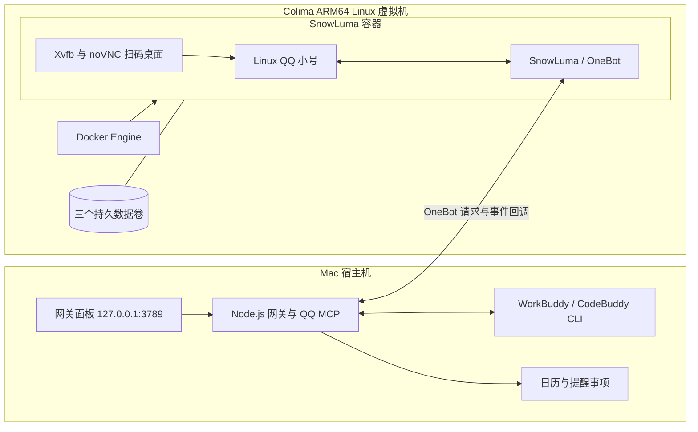

# Apple Silicon Mac：Colima + Docker + SnowLuma 部署实录

这是维护者当前部署方案的脱敏记录。2026-10-07 核对了运行中的 VM、镜像架构、容器、端口、数据卷和回调连通性；未上传镜像、虚拟机磁盘、账号、登录态、令牌或私人路径。版本是当时的部署基线，不是对最新版的保证。

**已有部署只参考配置和排障，不要重复执行新建步骤。** 下面的镜像构建与初次登录步骤供新机器使用；本次没有在生产环境重建镜像、容器或虚拟机。

## 1. 哪部分在虚拟机里



Mac 的日常 QQ 大号不需要退出；机器人小号登录容器里的 Linux QQ。WorkBuddy CLI、网关、每群工作目录及 Apple 自动化仍在 Mac 上。**QQ 被隔离不等于 Agent 被隔离**：授予会话“完全访问”仍可能让它访问 Mac 文件，不能把 VM 当成整机访问权限的替代安全边界。

## 2. 已核验的部署基线

| 项目 | 当前方案 |
| --- | --- |
| 宿主平台 | Apple Silicon macOS |
| Colima / Docker Engine | 0.10.3 / 29.5.2 |
| Colima profile / Docker context | `snowluma` / `colima-snowluma` |
| VM | Ubuntu 24.04.4 LTS，`aarch64`，Apple VZ，`virtiofs` |
| 资源 | 4 vCPU、6 GiB 内存、20 GiB 数据盘；rootDisk 为 20 GiB |
| 容器 / 镜像 | `snowluma` / 本地镜像 `snowluma-local:v1.14.15`，`linux/arm64` |
| 容器重启 / 共享内存 | `unless-stopped` / 1 GiB |
| 桌面 | `1920x1080x24`；QQ 登录后不必保持 noVNC 页面打开 |
| 注入权限 | `SYS_PTRACE`、`seccomp=unconfined`；不是 `--privileged` |
| 本机引擎 | 独立安装并登录的 WorkBuddy / CodeBuddy CLI |

实际镜像包含本地调整，不是本仓库发布的 Docker Hub 镜像；镜像名中的版本标签不能代替内容校验。下面使用官方框架重新构建同架构基线，不声称能得到现有私有镜像的相同 digest。新版本须重新核验 QQ、SnowLuma 和本项目上传扩展接口的兼容性。

## 3. 新机器建立虚拟机和镜像

先安装本项目 [README](../README.md#环境要求) 中的 Node、Python 与已登录 CLI。另需 Homebrew、Colima、Docker CLI、buildx 和 GitHub CLI；不要求同时运行 Docker Desktop。以下命令在 Mac 终端执行。

```bash
brew install colima docker docker-buildx gh

colima start --profile snowluma --runtime docker \
  --arch aarch64 --vm-type vz --mount-type virtiofs \
  --cpus 4 --memory 6 --disk 20

docker --context colima-snowluma info
docker --context colima-snowluma buildx version
```

如果 Homebrew 安装后仍找不到 buildx，按 `brew info docker-buildx` 提示配置 Docker CLI 插件目录，不要继续构建。Intel Mac 需要另一套架构参数，不直接照抄 ARM64 步骤。

从官方 Docker 框架构建 ARM64 镜像。`vendor/` 被本项目忽略，不把第三方发行包或构建产物提交到本仓库。

```bash
git clone https://github.com/SnowLuma/SnowLuma.Docker.Framework.git vendor/snowluma-docker
cd vendor/snowluma-docker
# 此提交是本次核对的本地框架基线；不要在未知版本上盲目复用补丁。
git checkout --detach 56b94f81bec717cba3a7728b83d64750a538a2d4
DOCKER_CONTEXT=colima-snowluma PLATFORM=linux/arm64 \
  SNOWLUMA_TAG=v1.14.15 IMAGE=snowluma-local:v1.14.15 \
  ./scripts/build-image.sh
cd ../..

docker --context colima-snowluma image inspect snowluma-local:v1.14.15 \
  --format '{{.Os}}/{{.Architecture}}'
```

构建脚本读取 SnowLuma Release 的 `linux-arm64-lite` 产物；本次已确认 `v1.14.15` 有对应资产。下载或构建失败时先查上游发布状态，不用来源不明的镜像顶替。也可选上游发布的固定标签或 digest，但不直接用浮动 `latest` 覆盖已登录的部署。

## 4. 初次创建容器

**仅当本 context 中还没有同名容器时执行。** 设置独立、随机的远程桌面密码；示例生成的密码只在你自己的终端显示，不填写 QQ 密码。

```bash
export VNC_PASSWD="$(openssl rand -hex 16)"
printf '请保存远程桌面密码：%s\n' "$VNC_PASSWD"

docker --context colima-snowluma run -d \
  --name snowluma --restart unless-stopped \
  --shm-size=1g --ulimit nofile=65536:1048576 \
  --cap-add=SYS_PTRACE --security-opt seccomp=unconfined \
  -e VNC_PASSWD -e TZ=Asia/Shanghai \
  -e SNOWLUMA_UID=1000 -e SNOWLUMA_GID=1000 \
  -e SNOWLUMA_SCREEN=1920x1080x24 \
  -e SNOWLUMA_WEBUI_HOST=0.0.0.0 -e SNOWLUMA_WEBUI_PORT=5099 \
  -e SNOWLUMA_HOOK_AUTOLOAD=1 \
  -p 127.0.0.1:3000:3000 -p 127.0.0.1:3001:3001 \
  -p 127.0.0.1:5099:5099 -p 127.0.0.1:6081:6081 \
  -v snowluma-data:/app/data \
  -v snowluma-qq-config:/app/.config \
  -v snowluma-qq-data:/app/.local/share \
  snowluma-local:v1.14.15

unset VNC_PASSWD
```

这些端口全部绑定 Mac 本机回环地址；不要去掉 `127.0.0.1:`。容器内部 WebUI / OneBot 则需要监听容器可访问的接口，否则端口发布了也不可达。OneBot 的监听与认证在 SnowLuma 中单独配置；不要以为 WebUI 的监听地址会替代 OneBot 设置。

| Mac 地址 | 用途 |
| --- | --- |
| `http://127.0.0.1:6081/` | noVNC 桌面，扫码登录 QQ 小号 |
| `http://127.0.0.1:5099/` | SnowLuma 管理页面 |
| `http://127.0.0.1:3000/` | OneBot HTTP API；需要独立令牌 |
| `127.0.0.1:3001` | OneBot WebSocket 预留端口；发布端口不表示已经启用服务 |
| `http://127.0.0.1:3789/client.html` | Mac 上的网关面板，不是容器端口 |

没有发布原始 VNC 的 `5900` 端口。维护者当前本地镜像使用过免密码 noVNC 标记，但这是本地调整，并非所有上游版本都有同样开关；新部署示例仍使用随机密码。免密码桌面绝不能开放到局域网或公网。容器的注入权限较高，只使用可信来源的框架和镜像。

## 5. 登录并连接 Mac 网关

1. 打开 noVNC，输入独立桌面密码，扫码登录小号；日常大号继续留在 Mac QQ。
2. 打开 SnowLuma WebUI。初次管理凭证按所选上游版本说明在本机获取；日志可能含凭证，不上传原始日志或截图。
3. 在 SnowLuma 中为已登录小号启用 OneBot HTTP：容器端口 `3000`、容器内可访问的监听地址和独立随机访问令牌。
4. 设置 HTTP 事件上报地址为 `http://host.docker.internal:3789/api/onebot/event`，配置与 Hub 一致的回调令牌或签名。该地址在本次 Colima 部署中已从容器验证能到达网关；其他 VM / 网络模式必须自己复验，不硬编码虚拟机 IP，也不能用容器的 `127.0.0.1` 指代 Mac。
5. 按 README 创建私有 `config/qq-only.env`、实际账号和白名单，并把 OneBot / Hub 凭证放入 macOS 钥匙串。`ONEBOT_API_BASE=http://127.0.0.1:3000` 是 **Mac 网关调用容器** 的地址，不是第 4 步的反向上报地址。

与本方案对应的非秘密网关参数：

```dotenv
CODEX_REMOTE_CONTACT_HOST=127.0.0.1
CODEX_REMOTE_CONTACT_PORT=3789
ONEBOT_API_BASE=http://127.0.0.1:3000
CODEX_REMOTE_CONTACT_COLIMA_PROFILE=snowluma
CODEX_REMOTE_CONTACT_DOCKER_CONTEXT=colima-snowluma
CODEX_REMOTE_CONTACT_SNOWLUMA_CONTAINER=snowluma
CODEX_REMOTE_CONTACT_DOCKER_PATH=/opt/homebrew/bin/docker
CODEX_REMOTE_CONTACT_NODE_PATH=/opt/homebrew/bin/node
CODEX_REMOTE_CONTACT_QQ_FILE_STAGING_ROOT=/tmp/codexremotecontact-qq-files
```

这些只是配套参数，不是完整配置。账号没有默认值；Hub、OneBot API 和回调凭证的具体要求见 [README](../README.md#配置与启动) 与 [安全说明](../SECURITY.md)。免令牌面板仅允许本机回环访问，不解除 OneBot 回调鉴权。

## 6. 持久数据与文件清理

| 所在层 | 位置 | 内容与生命周期 |
| --- | --- | --- |
| Mac | `runtime/qq-only-data/` | 活动消息、会话映射、订阅、表情及设置；不入库 |
| Mac | `runtime/group-workspaces/` 与 CLI 私有会话目录 | 每群工作文件与引擎持久上下文；不入库 |
| VM 的 Docker 数据卷 | `snowluma-data` → `/app/data` | SnowLuma 配置、缓存和数据库；升级保留 |
| VM 的 Docker 数据卷 | `snowluma-qq-config` → `/app/.config` | Linux QQ 配置；升级保留 |
| VM 的 Docker 数据卷 | `snowluma-qq-data` → `/app/.local/share` | QQ 登录态与数据；升级保留 |
| 容器临时目录 | `/tmp/codexremotecontact-qq-files/<job-id>/` | 当前发送任务的临时副本；成功、失败均尝试清理 |

QQ 容器没有直接挂载整台 Mac 或 NAS。发送时网关先按当前会话权限核验真实路径，再通过 `docker cp` 把选定文件复制到容器专用暂存目录，上传结束后清理该任务副本，原文件不动。图片优化副本也会清理；收到的消息原图仍按 pending / 订阅引用规则保留，不能在表情识别完成时提前删掉。

进程被强制杀死时 `finally` 无法保证执行；暂存管理器下次初始化会清理专用暂存前缀中的旧副本。这不是任意目录清理权限。卷、虚拟机磁盘和 QQ 登录态不属于自动清理范围；不要执行带 `--volumes` 的全局清理或删除 Colima profile 来“修复登录”。

## 7. 登录后自启与恢复

在项目根目录运行 `./modules/chat-hub-start.command`。它安装 runner 和两个 plist，并加载当前用户的服务；不能只临时运行 Node 就认为完成了自启。此处是 **Mac 登录后启动**，不在 FileVault 解锁前运行。

| 系统服务 | 行为 |
| --- | --- |
| `local.codexremotecontact.chat-hub` | `RunAtLoad` 启动 Mac 网关；异常退出由 launchd 恢复，不等待 VM 就绪 |
| `local.codexremotecontact.qq-runtime` | 登录时运行，之后每 60 秒检查既有 VM 与容器；只恢复、不重建 |

plist 必须实际保留在当前用户的 `~/Library/LaunchAgents/`。项目 `config/` 中的生成文件或当前正在运行的进程，都不能替代系统目录里的安装文件。2026-10-07 的一次启动失败正是两个已安装 plist 缺失；重新安装和加载后，面板及 QQ 登录状态恢复。无法仅凭文件缺失判断是谁删除了它们。

启动与停止命令：

```bash
./modules/chat-hub-start.command
# 主动停止后台监控；不删除容器、数据卷或会话数据
./modules/stop-chat-hub.command
```

恢复脚本通过 Node `--env-file` 读取私有配置，不由 launchd 的 shell 直接 `source` Documents 下的文件；这不绕过 macOS 隐私保护，Node 仍需相应目录的授权。Colima 状态探测最多 20 秒；仅确认失效的 PID / socket 标记会移入备份，活动或不确定状态等待下一轮，不误杀复用同一 PID 的其他程序。

首次登录、系统更新或 VM 恢复可能需要数分钟。`unless-stopped` 只管理已经运行的 Docker Engine 内的容器，不能自己启动 Mac 上的虚拟机；QQ 恢复任务补齐这一层。

## 8. 验收与常见故障

以下为只读检查，不调用模型，也不发送 QQ 消息：

```bash
launchctl print "gui/$(id -u)/local.codexremotecontact.chat-hub"
launchctl print "gui/$(id -u)/local.codexremotecontact.qq-runtime"
colima status --profile snowluma
docker --context colima-snowluma ps --format '{{.Names}} {{.Status}}'
curl --noproxy '*' -fsS --max-time 5 \
  http://127.0.0.1:3789/client.html -o /dev/null
docker --context colima-snowluma exec snowluma node -e \
  'fetch("http://host.docker.internal:3789/client.html",{signal:AbortSignal.timeout(5000)}).then(r=>console.log(r.status)).catch(()=>{console.error("callback route unavailable");process.exitCode=1})'
```

应分别确认：面板返回成功、容器在线、OneBot 带正确认证的 `get_login_info` 返回真实小号，以及新 QQ 消息实际进入面板。回调路由的 GET 返回 200 只验证网络，不代替真实事件上报验收。QQ 恢复服务一次检查完成后显示 `not running` 且退出码 0 是正常情况，之后按分钟重跑；不能把它当成网关长驻进程。

| 现象 | 先检查 |
| --- | --- |
| 整个面板打不开、服务查不到 | 两个系统 plist 是否存在、服务是否禁用；同一部署重新运行启动脚本安装缺失项 |
| 面板在线但 QQ 离线 | VM / Docker / 容器 / 小号登录分别核验；不要先清空 QQ 数据 |
| OneBot 返回 401 | API 令牌不匹配或未提供，不代表小号已退出 |
| 小号在线但面板没有新消息 | OneBot 事件上报、容器到 Mac 的回调路径、回调鉴权及白名单 |
| 能发文字但发文件 `ENOENT` | 必须先暂存到容器；Mac 路径不会自动出现在 Linux QQ 环境 |
| 写入报 `ENOSPC` | 同时查 Mac 剩余空间和 VM 数据盘；保护三个卷及原文件，不用清空登录态解决 |
| 系统更新后 Colima 暂不可用 | 看恢复日志与失效标记备份，等待有界重试；不手工乱删磁盘或杀进程 |

本次运行状态已核验；新机器从下载、构建到扫码的完整流程，以及下一次整机重启后的自动恢复，仍需在目标机器验收。备份必须覆盖 Mac 的私有状态及 VM 内的三个持久卷，仅备份网关源码不能恢复 QQ 登录。

## 上游依据

- [Colima 官方配置说明](https://colima.run/docs/configuration/)：VZ、资源与挂载选项。
- [SnowLuma Docker 部署说明](https://snowluma.github.io/en/docs/guide/deploy/docker)：QQ 桌面、接口及持久目录。
- [SnowLuma 官方 Docker 框架](https://github.com/SnowLuma/SnowLuma.Docker.Framework/tree/56b94f81bec717cba3a7728b83d64750a538a2d4)：本文构建基线；更新版本请重新核验接口与配置。
- [SnowLuma v1.14.15 Release](https://github.com/SnowLuma/SnowLuma/releases/tag/v1.14.15)：对应 ARM64 `lite` 资产。本仓库不分发该发行包或第三方镜像。
